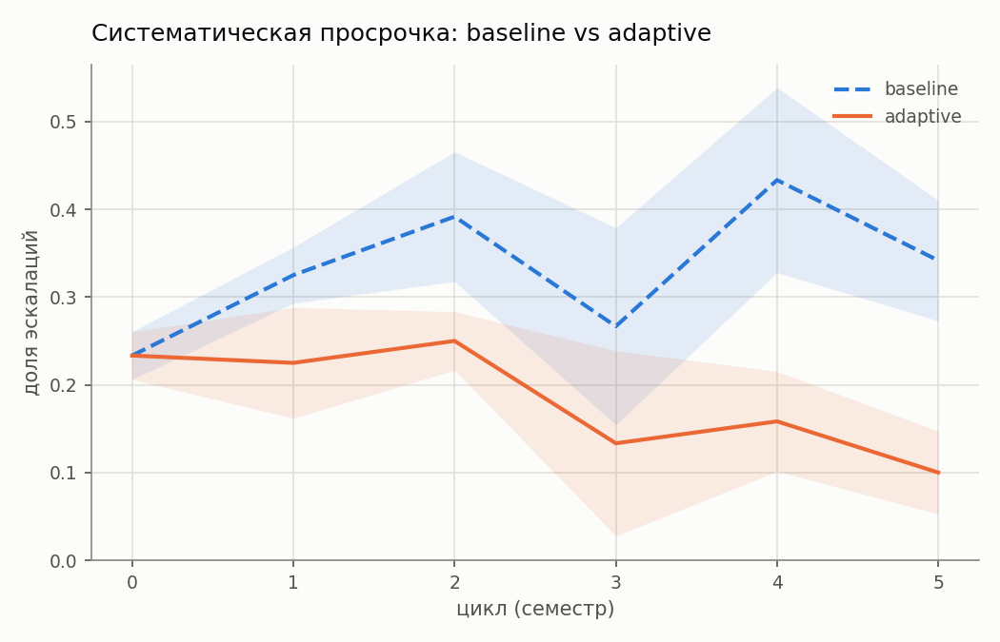
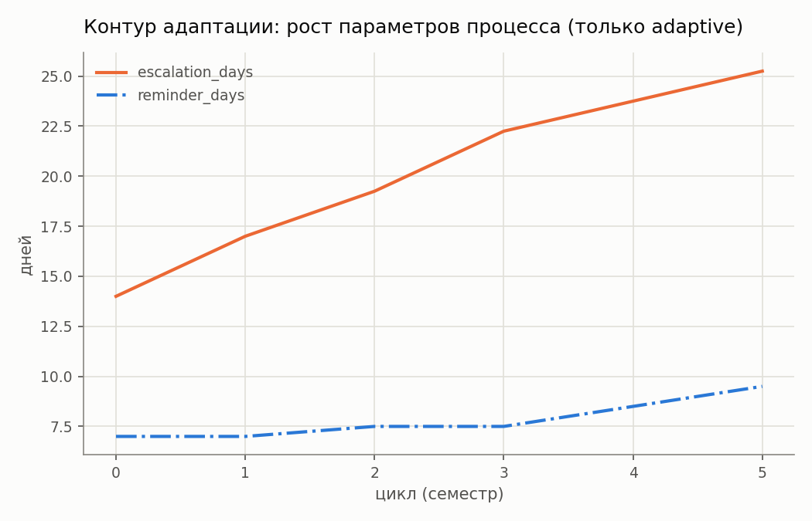

# Результаты эксперимента (T-54)

> Источник данных: `results_reduced.csv` (4 seed × 6 циклов × 2 режима).
> Дизайн и методология — `experiment/DESIGN.md`.

## Главный график: сходимость adaptive к меньшей доле эскалаций

**Последний цикл (cycle=5)**: baseline=0.342, adaptive=0.100, среднее изменение по seed -0.242, улучшение в 4/4 seed(ах).

## Как меняются параметры процесса (только adaptive)

Baseline не показан — параметры там зафиксированы на всех циклах по определению дизайна.

## Таблица по циклам

| regime | cycle | mean escalated_fraction | std | n_seeds |
|---|---|---|---|---|
| adaptive | 0 | 0.233 | 0.027 | 4 |
| adaptive | 1 | 0.225 | 0.063 | 4 |
| adaptive | 2 | 0.250 | 0.033 | 4 |
| adaptive | 3 | 0.133 | 0.105 | 4 |
| adaptive | 4 | 0.158 | 0.057 | 4 |
| adaptive | 5 | 0.100 | 0.047 | 4 |
| baseline | 0 | 0.233 | 0.027 | 4 |
| baseline | 1 | 0.325 | 0.032 | 4 |
| baseline | 2 | 0.392 | 0.074 | 4 |
| baseline | 3 | 0.267 | 0.112 | 4 |
| baseline | 4 | 0.433 | 0.105 | 4 |
| baseline | 5 | 0.342 | 0.069 | 4 |
